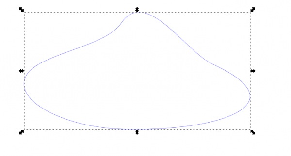
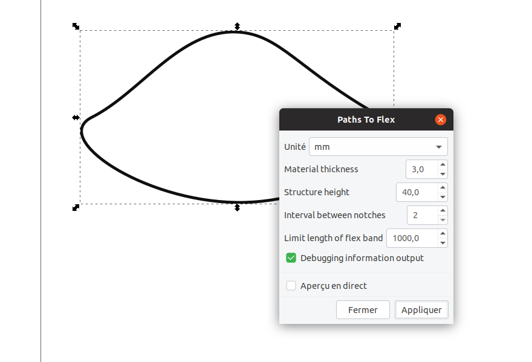
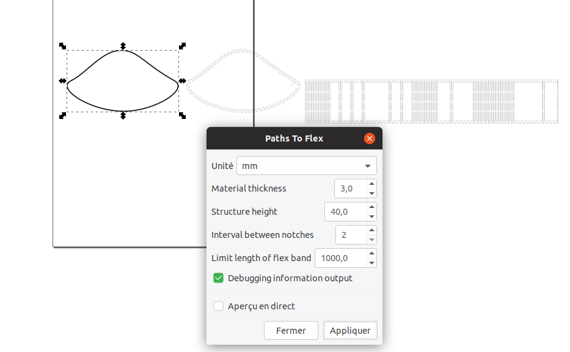

# Path2flex
This is an inkscape extension which will create a "flex" structure around "any" path suitable for laser cut
##Installation

In order to install this inkscape extension, copy the two files in your inkscape extensions directory.
- For Linux, this could be ~/.config/inkscape/extensions if you want to keep this extension personal, or /usr/share/inkscape/extensions if you would like to make it available to all users on your computer.
- For Windows,this is usually C:\Program Files\Inkscape\share\extensions but this could change if inkscape is installed elsewhere. On my windows computer, it is C:\Programmes\Inkscape\share\extensions

Then launch inkscape, and on the menu "extensions" a sub-menu entry Fablab should be present. In this entry, you should finf "path2flex".

##Usage
First, you should draw a path within inkscape. Then select this  **path** (use Object to Path to make a real path if you have drawn some characters, rounded rectangles and so on).
You can use any path, but beware wood is not very much flexible so you should not use too tight curves in your path. It will depend on yout wood thickness of course, but do not use curves with a radius under 10-15mm.
 
Then Use "Extensions/Fablab/Paths To Flex..." a dialog box will appear:

1. Material thickness : select a value compatible with you material. You should only use thin wood, thickness over 5mm will give bad results, as the wood will not be flexible enough.
2. Structure height : this is the height of the flex structure, it will be the height of the finished box. 
3. Inteval between notches : by default, each notch is about two millimeter wide, and notches are separated by 2 millimeters interval as well. This could be changed in order to reduce the number of notches by increasing the intervall between notches. Enter an integer between 2 and 10. Reducing the number of notches will lead to a box maybe more fragile, but muxh easier to assemble.
4. Limit length of the flex band : if you want to build large structure, the length of the flex could be large and override the size of your laser cutting machine. In this case, this option will build several flex bands, ecah one shorter than the maximum size.
5. Debugging information. This program will generate a text file under the inkscape extension directory which could be useful to help understanding its bahaviour in case of problem.

When all fileds are completed, click on apply, and a structure with notches and flex will be drawn.

- Note that flex structure is not drawn when not needed (when structure is not curve). This will save a great time of laser cutting time.
- There is also a small red line on the structure with notches which will tell you where to start the flex assembly. The structure should be assembled clockwise, start a the line and go clockwise. 
- If you want to build an actual box, you should duplicate the path with notches (Ctrl+D with inkscape), and it you be useful to invert it horizontaly if the two faces of your wood are not identical.
##Conclusion
I hope that this inkscape extension could be useful and will help you in your designs.
I would like to thank Dan Newman for his inkscape extension "Path2OpenSCAD", the code of this extension is partially based on his work. 